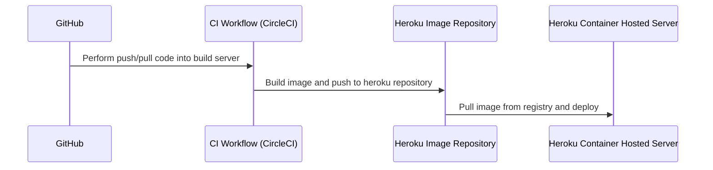

# Coaching | SCTP in SE | Module 4 | DevOps Week 4

<details>
<summary> 1. Next.js and Vercel </summary>

## What is Next.js?

Next.js is a full stack web application framework developed by Vercel. 

|Feature|React|Next.js|
|-|-|-|
|Routing|Use of react router|Use of folder structure for routing|
|Pre-fetch|N/A|When a link is on the screen, or mouse over a certain link, Next.js can pre-fetch the data so that when user clicks on them, the load time is faster.|
|Serverless API|React is a pure frontend framework.|Next.js comes with the ability to develop serverless API if you are using client-side component (SPA), or Server Actions if you are using server-side component.|
|Debugging|React comes with debugging tools.|Next.js has debugging tools. When deployed to Vercel as staging, there are collaboration tool comes out of the box.|

## Objective

This guide will take you through the process of setting up a Next.js project, pushing it to GitHub, and configuring automatic deployments to Vercel. Each new push to GitHub will trigger a Vercel deployment, creating a dedicated URL for that deployment.

> At the end of the walkthrough, we will discuss the difference between Vercel and CircleCI.

## Prerequisites

Before you begin, ensure you have the following:
- Node.js installed (LTS version recommended).
- Git installed and configured.
- A GitHub account.
- A Vercel account.

## Step 1: Initialize a Next.js Project

1. Open your terminal.
2. Create a new Next.js app by running:
```bash
   npx create-next-app@latest my-next-project
```
3. Change into project directory:
```bash
cd my-next-project
```

## Step 2: Create a Repository on GitHub

1. Go to GitHub and log in to your account.
1. Click on the "New" button to create a new repository.
1. Name your repository and leave it public for easier access.
1. Do not initialize it with a README, .gitignore, or license.

## Step 4: Push Your Local Repository to GitHub

1. Copy the remote repository URL from GitHub.
2. Link your local repository with the remote repository:
```bash
git remote add origin <YOUR_GITHUB_REPO_URL>
```
3. Push your changes to GitHub:
```bash
git push -u origin master
```

## Step 5: Connect Your GitHub Repository to Vercel

1. Log in to your Vercel account.
1. Click on "New Project".
1. Select your GitHub repository.
1. Click on "Import" and follow the setup instructions, keeping most settings at their defaults.

## Step 6: Automatic Deployment Setup

1. Every push to your GitHub repository will now trigger a new deployment to Vercel.
1. Vercel automatically creates a unique URL for each deployment.

## Step 7: Viewing Deployment History

1. Go to your project's dashboard on Vercel.
1. Click on the "Deployments" tab to view all the deployments.
1. Each entry shows the deployment's unique URL.

## Conclusion

You now have a fully functional workflow that initializes a Next.js project, tracks it with Git, and deploys updates to Vercel with unique URLs for each push. This setup is ideal for continuous integration and delivery practices in modern web development.

## Discussion

> What difference do you notice between CircleCI and Vercel? How do you choose between them?

</details>

<details>
<summary> 2. Industry Standard for Security </summary>

## What is DevSecOps

DevSecOps, short for Development, Security, and Operations, integrates security practices within the DevOps process. It aims to automate and embed security at every phase of the software development lifecycle, from initial design through integration, testing, deployment, and software delivery. This approach ensures that security considerations are not an afterthought but are integrated throughout the development process.

## Security Dilemma


In today’s fast-paced technological landscape, organizations face the ongoing challenge of balancing the need to reduce delivery friction with the necessity to comply with stringent corporate policies. This balance is crucial, particularly in fields such as software development and system deployment, where the speed of delivery can be essential for competitive advantage, yet strict adherence to security, regulatory, and quality standards is non-negotiable.

Examples:
- Tools that improve delivery are not approved for use
- Tools that improve delivery are not compatible with current architecture governed by infra and network policy
- The speed of tools adoption is slowed down by corporate policy
- DevSecOps Engineers are required to adapt to fast-changing delivery requirement and getting up to date with security policy and standards

</details>

<details>
<summary> 3. Understanding Other Roles - SRE and Platform Engineering </summary>

## Definitions

**DevOps** is a set of practices and philosophies aimed at shortening the development life cycle, ensuring continuous delivery with high software quality. It emphasizes collaboration between development and operations teams.

**Platform Engineering** involves creating and maintaining shared platforms used by development teams to run their applications. It focuses on building and scaling infrastructure and tooling to enhance developer productivity and operational efficiency.

**Site Reliability Engineering (SRE)** is a discipline that incorporates aspects of software engineering and applies them to infrastructure and operations problems. The goal is to create scalable and highly reliable software systems.

## Comparison Table

| Aspect               | DevOps                                       | Platform Engineering                             | SRE                                            |
|----------------------|----------------------------------------------|--------------------------------------------------|------------------------------------------------|
| **Focus**            | Collaboration between dev and ops            | Building and scaling shared platforms            | Operational reliability of software            |
| **Goal**             | Improve deployment frequency, error recovery | Enhance developer productivity, efficiency       | Achieve high system reliability and uptime     |
| **Primary Tasks**    | CI/CD pipelines, monitoring, automation      | Building internal tools, infrastructure upkeep   | Incident management, post-mortem analysis      |
| **Outcome**          | Faster time to market, fewer failures        | Streamlined workflows, consistent environments   | Predictable, reliable system behavior          |

## Pictorial Comparison


</details>

<details>
<summary> 4. Module 4 Project</summary>


</details>